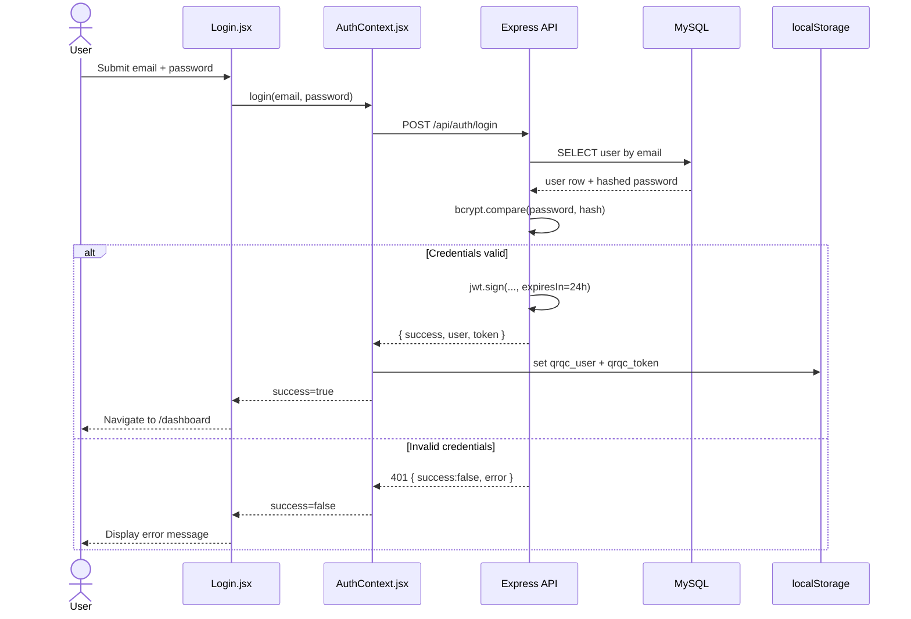
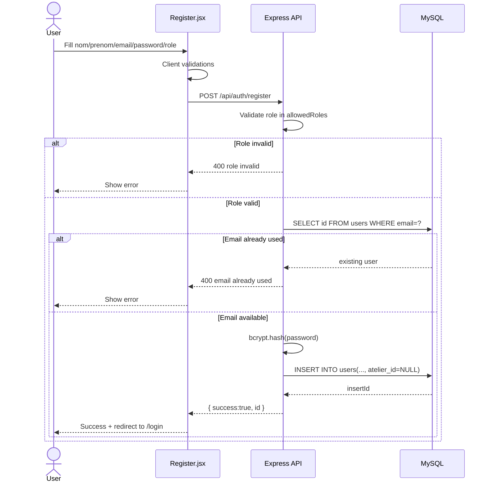
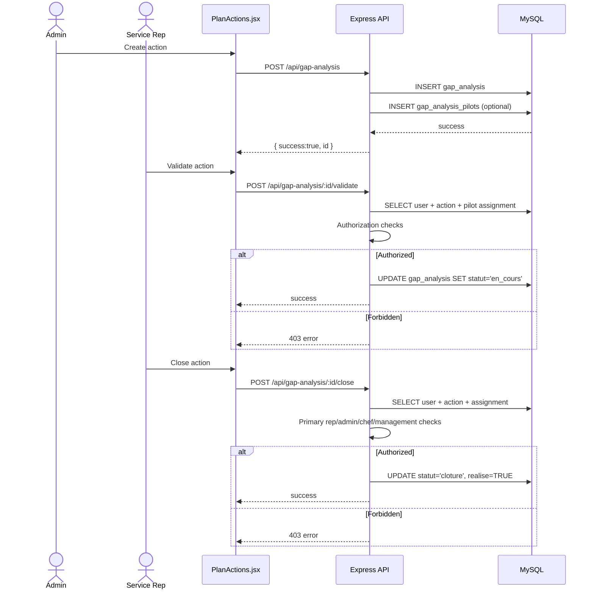
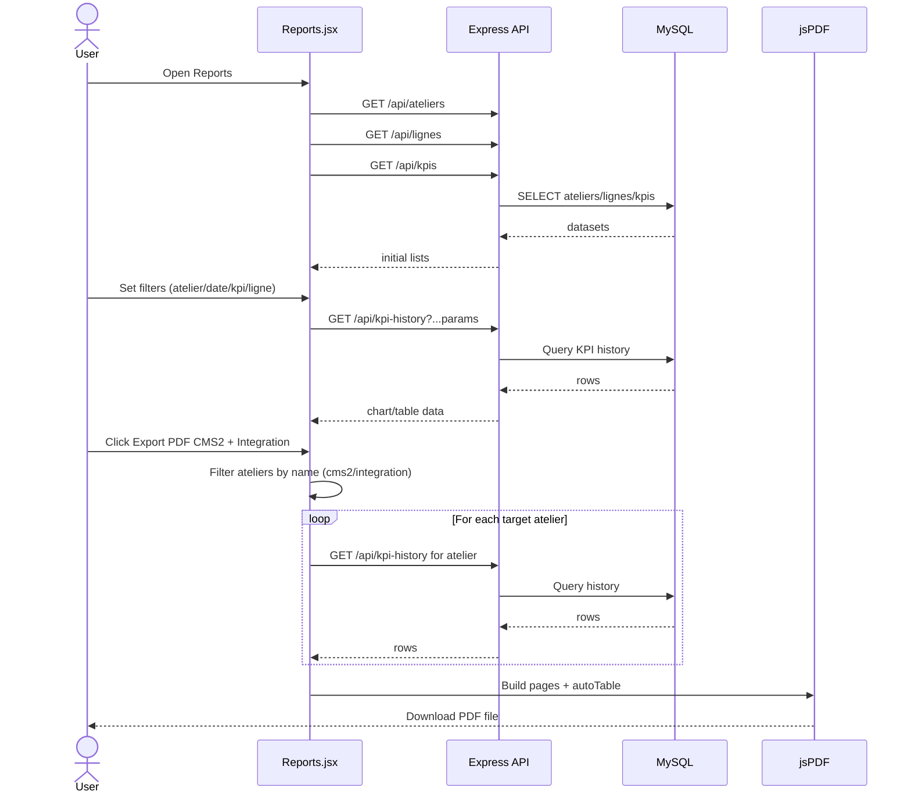
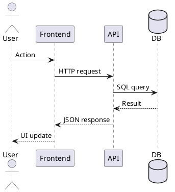

# UML Sequence Diagrams (QRQC)

These diagrams are based on the current frontend and backend flows.

## 1) Login Flow

## 2) Self-Registration Flow

## 3) Gap Analysis Action Lifecycle

## 4) Reports + PDF Export (CMS2/Integration)

## Optional PlantUML Starter

